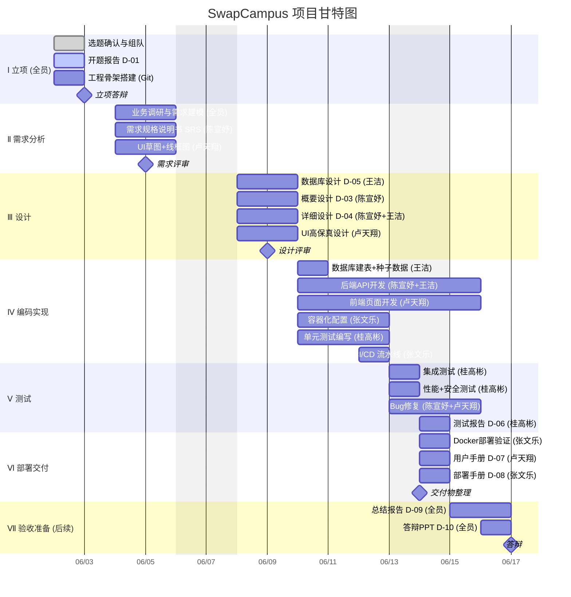

# SwapCampus 项目计划 —— 甘特图与关键路径

> 团队分工 · 时间：2026年6月2日（周二）→ 6月14日（周日），共13天（含周末缓冲6/6-7）

---

## 一、团队分工

| 姓名 | 角色 | 职责范围 |
|------|------|----------|
| **卢天翔** | 前端 + UI/UX | Vue 3 页面开发、Element Plus 组件、交互设计、用户手册 |
| **陈宣妤** | 后端（业务逻辑） | Spring Boot API、Service 层、Controller 层、概要/详细设计 |
| **王洁** | 数据库 + 后端协助 | MySQL 表设计、DDL/SQL、MyBatis Mapper、协助后端编码 |
| **张文乐** | 容器化与部署 | Docker / Docker Compose、CI/CD、Nginx、部署运维手册 |
| **桂高彬** | 测试与质量保障 | 单元测试、集成测试、性能测试、安全测试、测试报告 |

---

## 二、甘特图



---

## 三、关键路径分析 (Critical Path)

### 3.1 关键路径图

```
                    ┌──────────────────────────────────────────────────────┐
                    │              关键路径 (Critical Path)                  │
                    │       总工期: 12天  |  浮动: 1天（周末6/6-7缓冲）       │
                    └──────────────────────────────────────────────────────┘

  D1-D2(6/2-3)  D3-D4(6/4-5)   D5-D6(6/8-9)    D7-D10(6/10-13)   D11-D12(6/13-14)
  ┌──────────┐  ┌──────────┐  ┌──────────┐  ┌──────────────┐  ┌──────────────┐
  │   立项    │─→│ 需求分析  │─→│  概要设计  │─→│ 后端API开发   │─→│  集成测试     │
  │   2天    │  │   2天     │  │   2天     │  │    4天       │  │   2天        │
  │  (全员)  │  │(陈宣妤主) │  │(陈宣妤)   │  │(陈宣妤+王洁) │  │(桂高彬+全员) │
  └──────────┘  └──────────┘  └──────────┘  └──────────────┘  └──────────────┘
       │              │               │                 │                 │
       │      ┌───────┴───────┐       │                 │                 │
       │      │   UI原型设计   │       │                 │                 │
       │      │   (卢天翔)     │       │                 │                 │
       │      │   浮动: 2天    │       │                 │                 │
       │      └───────────────┘       │                 │                 │
       │                              │                 │                 │
       │               ┌──────────────┴──────────┐      │                 │
       │               │   数据库设计 D-05        │      │                 │
       │               │   (王洁)                 │      │                 │
       │               │   浮动: 2天              │      │                 │
       │               └─────────────────────────┘      │                 │
       │                                                │                 │
       │       ┌────────────────────────────────────────┴─────────────────┤
       │       │                   并行任务 (非关键路径)                     │
       │       ├───────────────────────────────────────────────────────────┤
       │       │  前端页面开发 (卢天翔, 4天)    浮动: 0天 (近关键)           │
       │       │  容器化配置 (张文乐, 3天)      浮动: 1天                   │
       │       │  单元测试 (桂高彬, 3天)        浮动: 1天                   │
       │       │  CI/CD流水线 (张文乐, 1天)     浮动: 3天                   │
       │       └───────────────────────────────────────────────────────────┘
       │                                                                     │
       └─────────────────────────────────────────────────────────────────────┘

                        ╔══════════╗
          6/6-6/7       ║  周末缓冲  ║   关键路径在此休息2天
                        ╚══════════╝
```

### 3.2 关键路径节点（Critical Path Nodes）

| 节点 | 任务 | 工期 | 开始 | 结束 | 前置依赖 | 负责人 |
|------|------|------|------|------|----------|--------|
| **CP1** | 立项与开题 | 2天 | 6/2 | 6/3 | — | 全员 |
| **CP2** | 需求分析 + SRS | 2天 | 6/4 | 6/5 | CP1 | 陈宣妤 |
| **CP3** | 概要设计 D-03 | 2天 | 6/8 | 6/9 | CP2 | 陈宣妤 |
| **CP4** | 后端 API 开发 | 4天 | 6/10 | 6/13 | CP3 | 陈宣妤+王洁 |
| **CP5** | 集成测试+修复 | 2天 | 6/13 | 6/14 | CP4 | 桂高彬+全员 |

> **关键路径总工期: 2+2+2+4+2 = 12天**
>
> 日历跨度 6/2→6/14（13天），中间含周末缓冲 6/6-7（2天）

### 3.3 浮动时间分析 (Float/Slack)

| 任务 | 最早开始 | 最晚开始 | 浮动 | 是否关键 |
|------|----------|----------|------|----------|
| 立项与开题 | 6/2 | 6/2 | **0天** | ✅ 关键 |
| 需求分析+SRS | 6/4 | 6/4 | **0天** | ✅ 关键 |
| 概要设计 D-03 | 6/8 | 6/8 | **0天** | ✅ 关键 |
| 后端 API 开发 | 6/10 | 6/10 | **0天** | ✅ 关键 |
| 集成测试+修复 | 6/13 | 6/13 | **0天** | ✅ 关键 |
| --- | --- | --- | --- | --- |
| UI 草图+线框图 | 6/4 | 6/8 | 2天 | |
| UI 高保真设计 | 6/8 | 6/10 | 2天 | |
| 数据库设计 D-05 | 6/8 | 6/10 | 2天 | |
| 数据库建表 | 6/10 | 6/12 | 2天 | |
| 前端页面开发 | 6/10 | 6/10 | 0天 | ⚠️ 近关键 |
| 容器化配置 | 6/10 | 6/11 | 1天 | |
| 单元测试 | 6/10 | 6/11 | 1天 | |
| CI/CD 流水线 | 6/12 | 6/14 | 3天 | |
| 用户手册 D-07 | 6/13 | 6/14 | 1天 | |
| 部署手册 D-08 | 6/13 | 6/14 | 1天 | |

> **⚠️ 前端页面开发虽不直接影响后端测试，但联调要求前后端同时就绪，浮动力0，属"近关键"任务。**
>
> 相比之前（6/4开始），多了2天前置时间使得 UI 设计、数据库设计获得更充裕的浮动。

---

## 四、各成员详细任务分解 (WBS)

### 卢天翔 — 前端 + UI/UX

| 日期 | 任务 | 交付物 |
|------|------|--------|
| 6/2-6/3 | 参与立项、熟悉项目需求、技术预研 | — |
| 6/4-6/5 | UI 草图 + 线框图（首页/详情/发布/聊天/订单/管理） | 线框图 |
| 6/8-6/9 | Element Plus 组件选型、高保真 UI 设计 | 设计稿 |
| 6/10-6/11 | 首页 + 商品详情 + 登录注册页面 | Vue 页面 |
| 6/11-6/12 | 发布商品 + 订单管理 + 聊天页面 | Vue 页面 |
| 6/12-6/13 | 个人中心 + 我的发布 + 管理后台页面 | Vue 页面 |
| 6/13-6/14 | 前后端联调、Bug 修复、用户手册 D-07 | 文档 |

### 陈宣妤 — 后端（业务逻辑）

| 日期 | 任务 | 交付物 |
|------|------|--------|
| 6/2-6/3 | 参与立项、立项答辩准备 | — |
| 6/4-6/5 | 需求分析、编写需求规格说明书 SRS | D-02 |
| 6/8-6/9 | 概要设计、详细设计 | D-03, D-04 |
| 6/10-6/11 | Auth + User + Category 模块开发 | Controller+Service |
| 6/11-6/12 | Goods + File（MinIO）模块开发 | Controller+Service |
| 6/12-6/13 | Order + Chat（WebSocket）模块开发 | Controller+Service |
| 6/13-6/14 | Admin 模块、前后端联调、Bug 修复 | 全模块 |

### 王洁 — 数据库 + 后端协助

| 日期 | 任务 | 交付物 |
|------|------|--------|
| 6/2-6/3 | 参与立项、了解数据需求 | — |
| 6/4-6/5 | 参与需求分析、梳理数据实体与关系 | — |
| 6/8-6/9 | 数据库设计：ER图、关系模式、DDL 脚本 | D-05, schema.sql |
| 6/10 | 数据库建表 + 种子数据 + 索引创建 | 可执行 SQL |
| 6/10-6/11 | Mapper 层开发（全部 MyBatis-Plus 接口+SQL） | Mapper 接口 |
| 6/11-6/13 | 协助陈宣妤开发 Order + Admin + Chat 模块 | Service 层 |
| 6/13-6/14 | 数据校验、接口联调协助 | — |

### 张文乐 — 容器化与部署

| 日期 | 任务 | 交付物 |
|------|------|--------|
| 6/2-6/3 | 参与立项、了解技术栈 | — |
| 6/4-6/5 | 参与需求分析、了解部署需求 | — |
| 6/8-6/9 | 熟悉项目架构、设计容器化方案 | — |
| 6/10-6/12 | 编写 Dockerfile（backend+frontend）、docker-compose.yml | Docker 配置 |
| 6/12 | GitHub Actions CI/CD 流水线配置 | .github/workflows/ci.yml |
| 6/12-6/13 | Nginx 反向代理配置、MinIO 集成验证 | nginx.conf |
| 6/13-6/14 | 一键部署验证（docker-compose up）、部署手册 D-08 | 文档 |

### 桂高彬 — 测试与质量保障

| 日期 | 任务 | 交付物 |
|------|------|--------|
| 6/2-6/3 | 参与立项、了解测试目标 | — |
| 6/4-6/5 | 参与需求分析、梳理测试需求 | — |
| 6/8-6/9 | 阅读设计文档，编写测试计划 | 测试计划 |
| 6/10-6/11 | Auth + Goods 单元测试用例编写 | 测试代码 |
| 6/11-6/12 | Order + Message + Util 单元测试 | 测试代码 |
| 6/12-6/13 | Admin 模块测试、覆盖率统计 | 测试代码 |
| 6/13 | 集成测试（端到端业务流程）+ 性能测试 | 测试记录 |
| 6/13 | 安全测试（OWASP ZAP 扫描） | 测试数据 |
| 6/14 | 测试报告 D-06、缺陷统计与汇总 | D-06 |

---

## 五、风险与应对

| 风险 | 概率 | 影响 | 应对措施 |
|------|------|------|----------|
| 后端 API 延期 | 中 | 高（阻断前端联调） | 王洁可随时切换支援后端；优先完成核心 API（Auth/Goods/Order） |
| 前后端接口不一致 | 中 | 中 | 6/9 设计评审时冻结 API 契约（请求/响应格式）；联调前各自自测 |
| 测试覆盖率不达标 | 低 | 中 | 桂高彬 6/10 即开始编写测试；关键模块（Auth/Goods/Order）优先 |
| Docker 环境问题 | 低 | 低 | 张文乐 6/10 提前验证 MySQL/MinIO/Redis 容器互联 |
| 人员请假 | 低 | 高 | 每日早会同步进度；CP 关键路径上王洁可备份陈宣妤 |
| 周末 6/6-7 进度空窗 | 低 | 低 | 6/5 周五下班前完成需求评审，周末自愿加班（不做强制） |

---

## 六、每日站会议程（全员，15分钟）

1. 昨天完成了什么？
2. 今天计划做什么？
3. 遇到什么阻碍？（需要谁协助？）

> 📌 建议每天早上 9:00 微信群文字同步，组长汇总记录。
>
> 🗓 关键节点提醒：6/3 立项答辩 → 6/5 需求冻结 → 6/9 设计冻结 → 6/14 交付物整理
